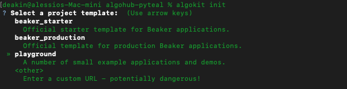
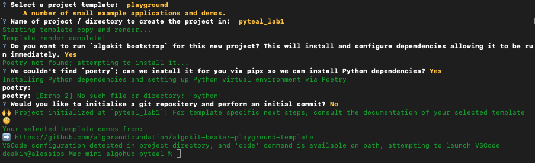
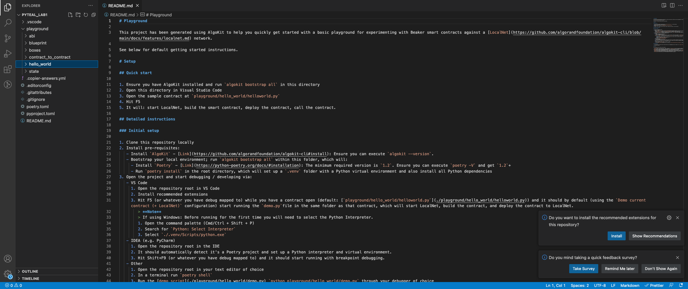
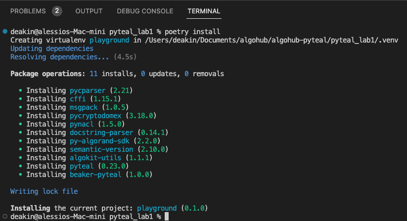
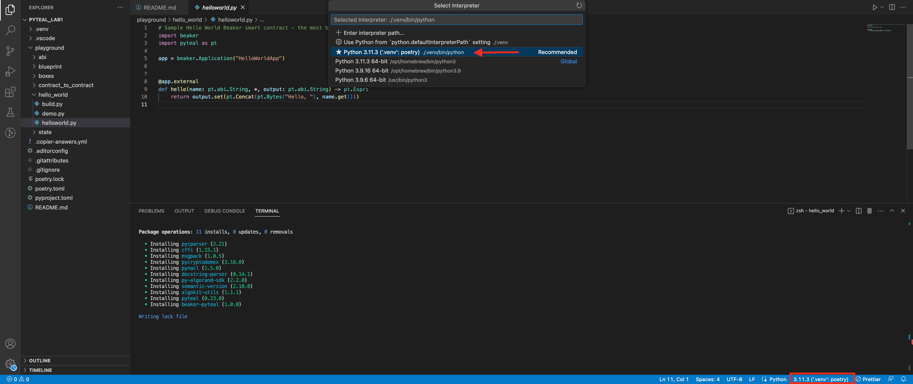

# Lab 1 - Setup development environment with AlgoKit

Hi everyone! The focus of this first lab is to setup your environment and get you comfortable working with the [AlgoKit](https://developer.algorand.org/algokit/) - as this will be really helpful when deploying, testing and experimenting with smart contracts.

These examples will be running on a machine running MacOS, but can also be used with other operating systems.

## Pre-requisites

### MacOS

- **Required**:
  - Git
  - docker 4.10+
  - python 3.10+
  - pipx
- **Recommended**:
  - Homebrew
  - Chrome
  - Visual Studio Code

### Windows

- **Required**:
  - Windows Subsystem for Linux 2 (WSL2)
  - Git
  - docker 4.10+
  - python 3.10+
  - pipx
- **Recommended**:
  - Visual Studio Code

> Follow [this link](https://developer.algorand.org/algokit/) for the detailed tutorial of how to install the prerequites for AlgoKit on both operating systems.

## Environment setup

For this exercise we will be using [AlgoKit](https://developer.algorand.org/algokit/). In our live video we will walk through the setup for MacOS, but the link provided in the previous section above has tips for all environments.

Note: The instructions below assume you have the pre-requisites installed and that you are using the command line (terminal on MacOS/Ubuntu, or WSL2 on Windows).

Open your terminal (WSL2 terminal for Windows), install AlgoKit tool

```bash
# macOS
brew install algorandfoundation/tap/algokit
```

```bash
# Windows
pipx install algokit
```

> :exclamation: After installation, you may need to close and reopen the terminal to use the `algokit` command.

Then, we need to install `poetry` to make sure our process is smooth

```bash
curl -sSL https://install.python-poetry.org | python3 -
```

Make a directory for the course and change directory into it

```bash
mkdir algohub-pyteal
cd algohub-pyteal
```

Then, we will initialize an AlgoKit project. Initializing an AlgoKit project allows us to:

> - :point_right: Select smart contract template.
> - :point_right: Bootstrap toolchain.
> - :point_right: Compile smart contract source code.

```bash
algokit init
```

We will choose the `playground` option which is the perfect choice for learning and playing around with smart contracts


Following the prompt, we will name our project and allow AlgoKit to setup the smart contract project template


After finishing configuring, the project will be opened in Visual Studio Code


Open the terminal in VS Code, use `poetry` to install dependencies for the project

```bash
poetry install
```



---

Troubleshooting: if you face the error `[Errno 2] No such file or directory: 'python'` on macOS, run the following command and restart the terminal:

```bash
sudo ln -s /opt/homebrew/bin/python3 /opt/homebrew/bin/python
```

---

In VS Code, choose the python interpreter with `'.venv':poetry`


> :exclamation: You may need to close and reopen the terminal to make sure all changes are updated.

:tada: Great! Our playground project is now all set and ready for smart contracts building!

[Compile smart contract](compile_smart_contract.md)

[Deploy smart contract on DappFlow](deploy_contract.md)
