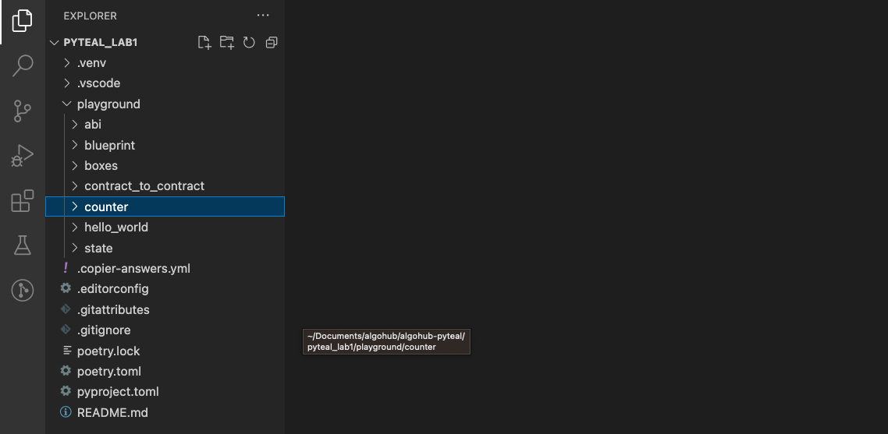
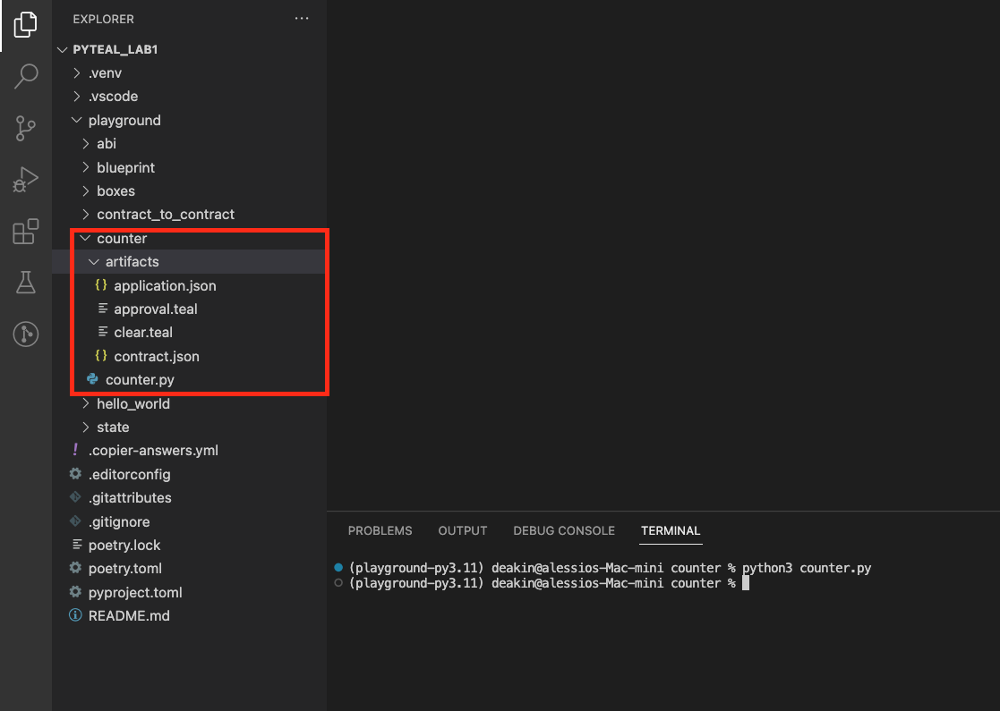

# Compile smart contract

## Compile beaker-pyteal smart contract

To start, let's create a new folder in the `playground` directory for our smart contract and name it `counter`


Now, head to the `algokit-pyteal-course` repository that we cloned in the previous module and navigate to Lab1 folder.

Navigate the `counter.py` file, copy it and paste it into the `counter` folder in our `playground`

In the terminal, navigate into the counter folder

```bash
cd playground/counter
```

And compile the smart contract with

```bash
python3 counter.py
```

The contract after being compiled will produce 4 new files inside the `artifacts` folder


Those files will be used in the next module to deploy the smart contract.
