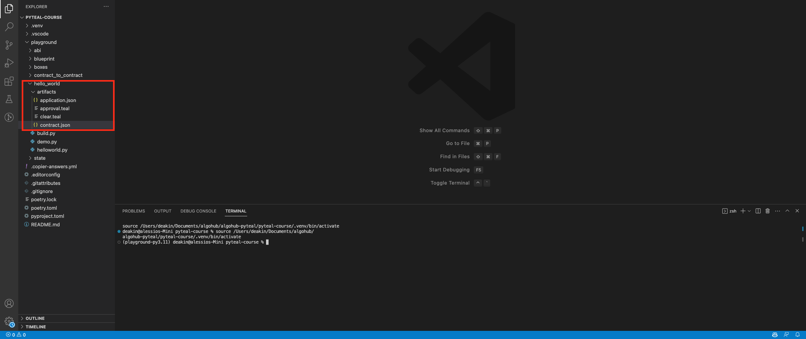

# Compile smart contract

## Compile beaker-pyteal smart contract

In the terminal, change directory into the **hello_world** folder

```bash
cd playground/hello_world
```

And compile the smart contract with

```bash
python3 build.py
```

The contract after being compiled will produce 4 new files inside the `artifacts` folder


Those files will be used in the next module to deploy the smart contract.
