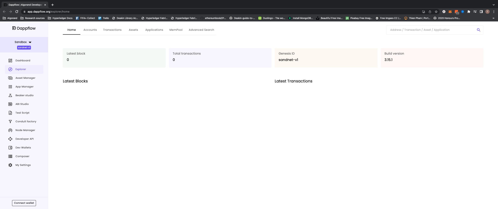
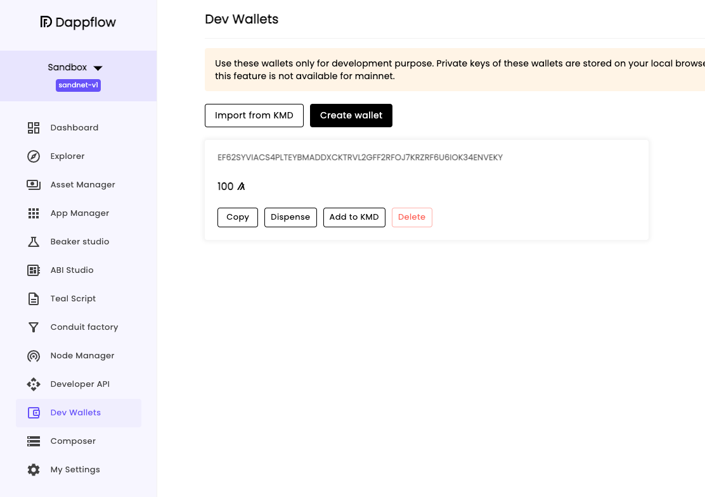
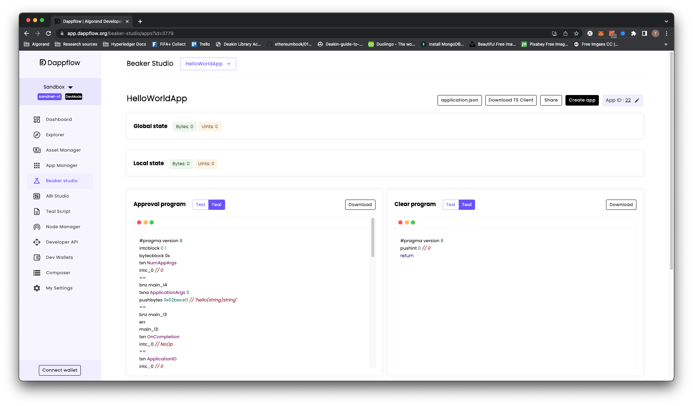

# Deploy smart contract on DappFlow

## Start the localnet

Make sure your Docker daemon is running on th background. In the terminal, use AlgoKit to start the `localnet` with

```bash
algokit localnet start
```

After the `localnet` is started, open DappFlow using

```bash
algokit explore
```

DappFlow will be opened in Chrome which looks like this


On DappFlow, choose **Dev Wallets** on the side menu and choose **Create wallet**. This will create a test wallet that we can play around with.


Then, we will connect to this wallet by hitting the **Connect wallet** button on the bottom left corner and choose the **Dev Wallet** option


As our `counter` smart contract is written in `beaker-pyteal`, we will use **Beaker studio** to deploy our smart contract.

Choose **Beaker studio** on the side menu , choose **Select app** > **Import beaker app** > Switch to **File** > choose **Upload file**

Navigate to the `counter` folder in our `playground` and choose to upload the `application.json` file inside the `artifacts` folder. After uploading, **Beaker studio** will look like this


Now, choose **Create app** > **Create** to deploy the smart contract.

:tada: Awesome! After deploying, we can try to execute the methods using the **Beaker studio**
