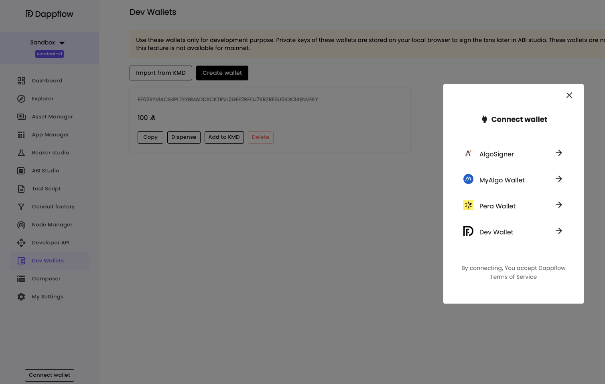

# Deploy smart contract on Algorand Testnet

## Connect to Algorand Testnet

Make sure your Docker daemon is running on th background. In the terminal, use AlgoKit to start the `localnet` with

```bash
algokit localnet start
```

After the `localnet` is started, open DappFlow using

```bash
algokit explore
```

In DappFlow, navigate to the top of the side menu and open the dropdown menu which is showing **Sandbox** and choose **Algonode testnet**


Then, we will connect to this wallet by hitting the **Connect wallet** button on the bottom left corner and choose the **Dev Wallet** option


Select the **Pera Wallet** option to connect to the account we created in the previous step. We will use **Pera Mobile App** in this app, so we choose to **Connect to Pera Mobile**


After connecting, we can see our Pera Wallet account address at the bottom left corner.

Now, we can use the **Beaker studio** to deploy our counter smart contract on the testnet (similar to [Lab 1 - Step 2](../Lab1/deploy_contract.md))


Choosing **Create app** will produce a popup in your **Pera Wallet** mobile app. This is a prompt for users to confirm their transactions on the blockchain


Choose **Confirm** to let the transaction go through. After successfully deployed, the smart contract will be available on the Algorand Testnet with a unique id.


In the **Explorer** view, the deployed application can be search by its id.
