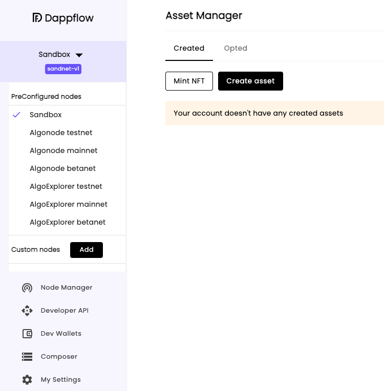
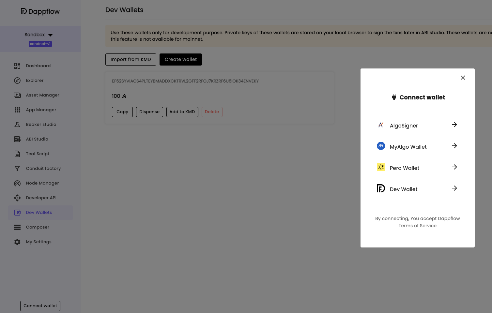
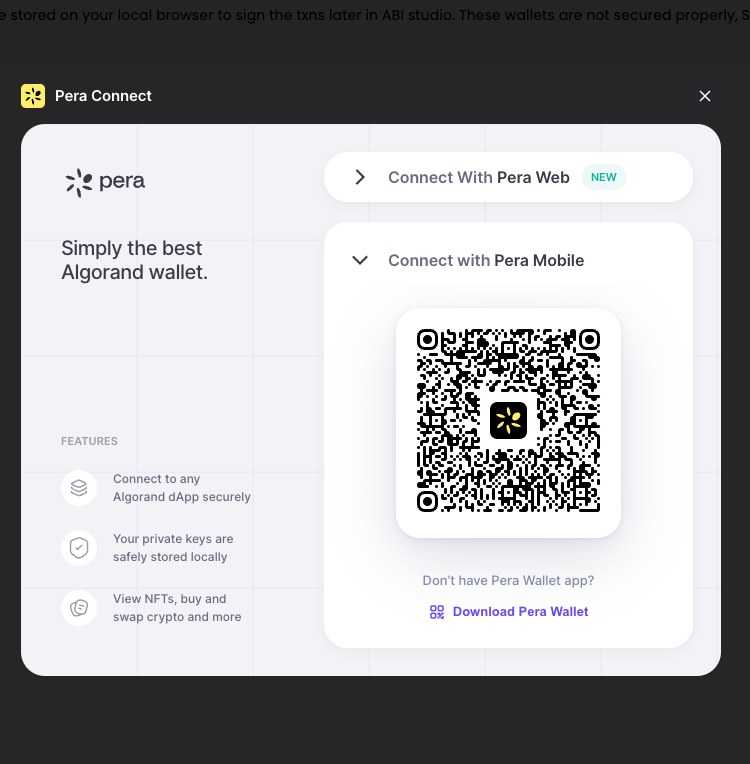

# Lab 3 - Smart Contract local state, redeploying and and updating web UI

Hi everyone! Welcome to Lab 3. The work we do in this lab directly builds off the previous, so please make sure that you have completed [Lab 2](../Lab2/README.md) before you get started.

In this tutorial, we are going to be making some changes to the PyTeal application we deployed previously, then redeploy it to the Algorand testnet and update the interface to reflect the changes.

## Connect to Algorand Testnet

Make sure your Docker daemon is running on th background. In the terminal, use AlgoKit to start the `localnet` with

```bash
algokit localnet start
```

After the `localnet` is started, open DappFlow using

```bash
algokit explore
```

In DappFlow, navigate to the top of the side menu and open the dropdown menu which is showing **Sandbox** and choose **Algonode testnet**



Then, we will connect to this wallet by hitting the **Connect wallet** button on the bottom left corner and choose the **Dev Wallet** option


Select the **Pera Wallet** option to connect to the account we created in the previous step. We will use **Pera Mobile App** in this app, so we choose to **Connect to Pera Mobile**



After connecting, we can see our Pera Wallet account address at the bottom left corner.

[Modify and compile counter app](./modifyAndDeploy.md)

[Update and experiment with the React UI](./updateUI.md)
